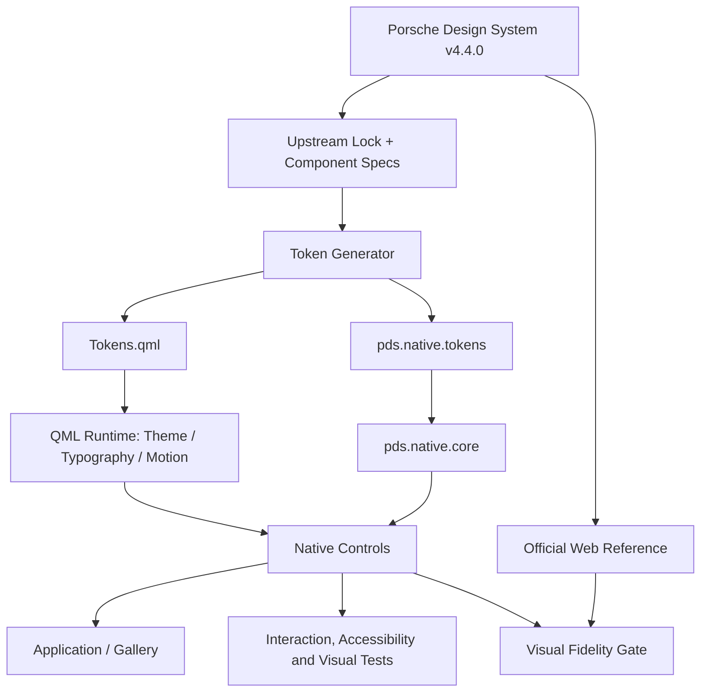

# Native Qt Quick Port of Porsche Design System v4

This repository ports the public Porsche Design System v4 implementation to
native Qt Quick. It is source-locked to upstream release **4.4.0** and measures
the native output against the official web component renderer.

This is an unofficial port and is not affiliated with, sponsored by, or
endorsed by Porsche AG. Restricted Porsche fonts, icons, marks, and media are
not redistributed. See [NOTICE.md](NOTICE.md) and
[docs/legal-and-assets.md](docs/legal-and-assets.md).



## Current calibrated scope

`Button.qml` and `Spinner.qml` are the current native component scope. Button
supports exactly the v4.4.0 contract used by `p-button`: Primary/Secondary,
normal/compact, hidden label, external icon source, disabled, loading,
hover/active, keyboard focus, Light/Dark/System, and RTL.

The Button fidelity gate passes at:

- maximum component-bounds deviation: 1 logical pixel;
- maximum height deviation: 0 logical pixels;
- structural geometry similarity: 0.99622;
- overall pixel similarity: 0.99482;
- mean RGB delta: 1.321.

Open [the generated fidelity report](tests/visual/reports/button-fidelity.html)
for official, native, overlay, and amplified-diff images.

Later milestone components are intentionally not exposed until they are rebuilt
from the locked upstream source and pass the same calibration process.

## Build and test

```sh
cmake --preset dev
cmake --build --preset dev
ctest --preset dev --output-on-failure
```

The verified local toolchain is Qt 6.11.1, CMake 4.3.4, Ninja, Clang 22.1.8,
and C++26 modules. The build regenerates and validates all 158 extracted
upstream tokens before compiling.

## QML usage

Public QML filenames are unprefixed because the module URI supplies identity:

```qml
import Pds.Native

Button {
    text: qsTr("Continue")
    variant: Button.Primary
    compact: false
}
```

Use `Theme.fontFamily` to inject a properly licensed Porsche Next family. The
repository otherwise uses the documented metric-calibrated fallback.

## Current Output


## Repository map

- `upstream/`: immutable release lock and raw token snapshot
- `tokens/`: normalized source, schema, and generated QML/C++/Markdown
- `tools/`: token extraction and deterministic generation
- `spec/components/`: machine-readable upstream component specifications
- `src/pds/core/`: source-locked C++ module contracts
- `src/pds/qml/`: native singletons, primitives, and controls
- `examples/component-lab/`: neutral developer calibration tool
- `examples/reference-gallery/`: restrained reference presentation
- `tests/visual/`: official web, native Qt, overlays, diffs, and reports
- `docs/`: upstream audit, API mapping, adaptations, licensing, and traceability
